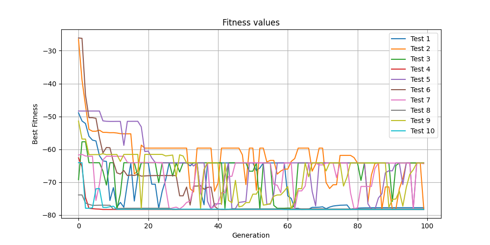
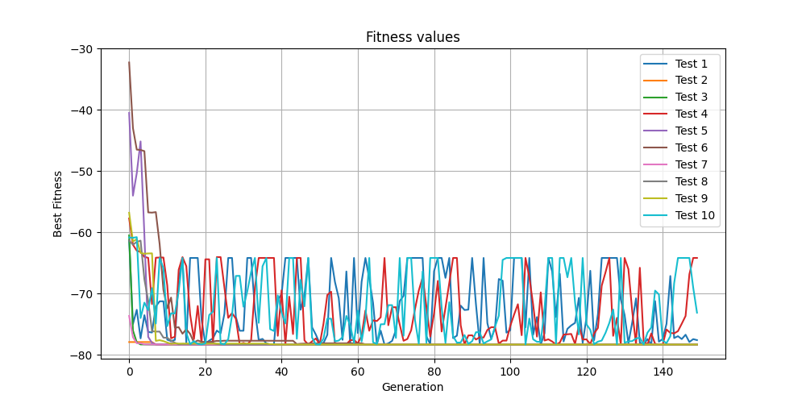
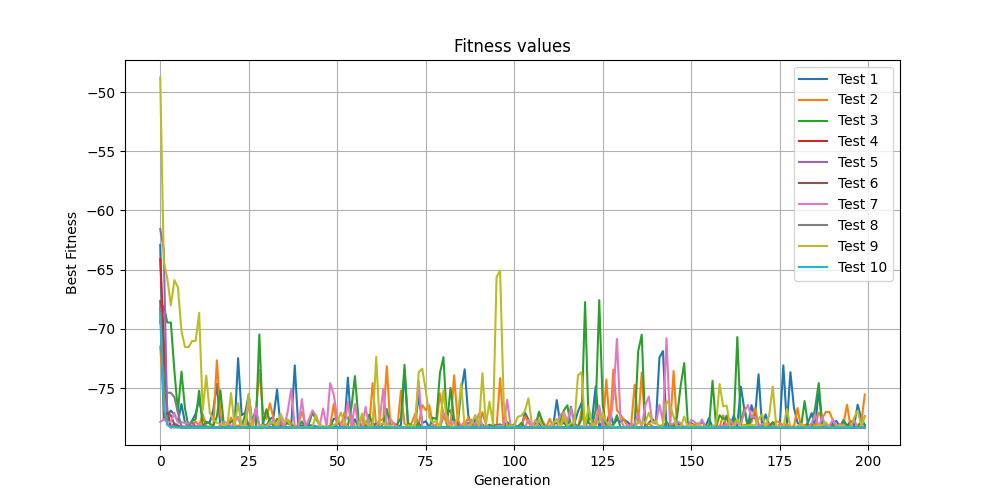
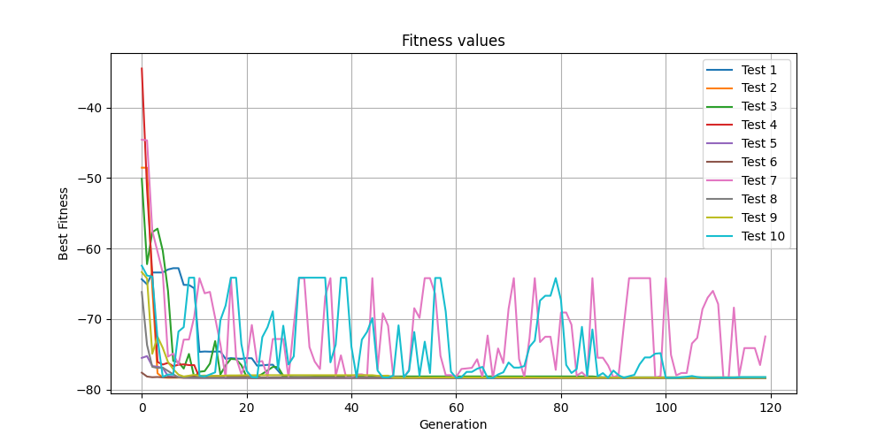
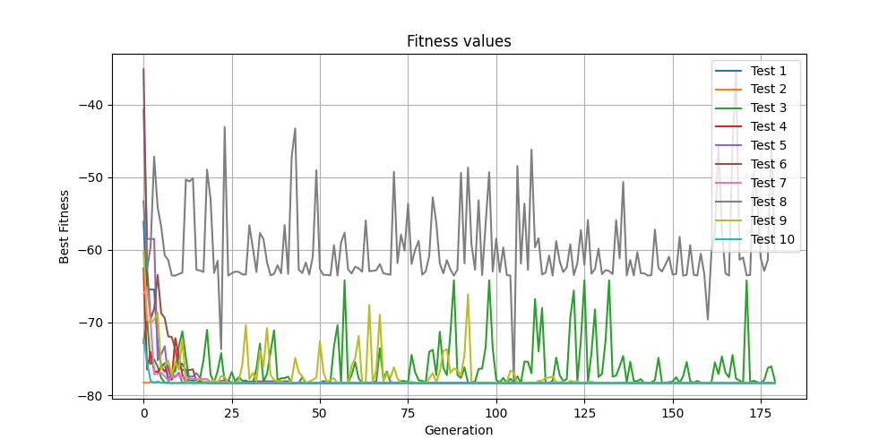
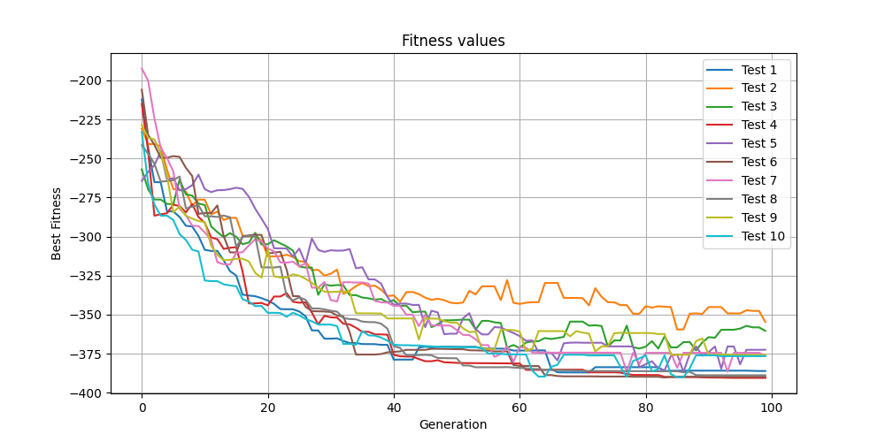
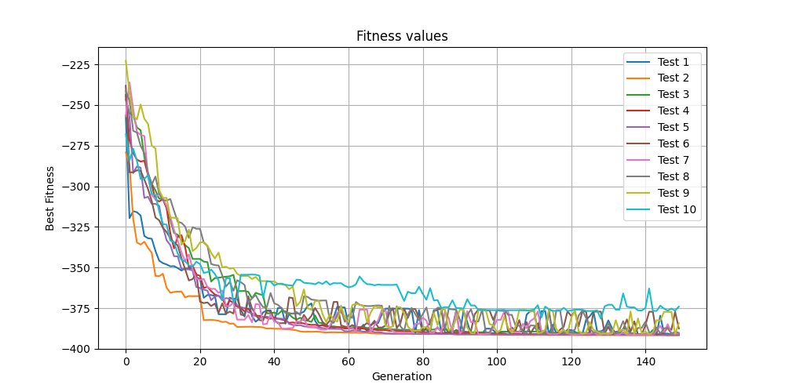
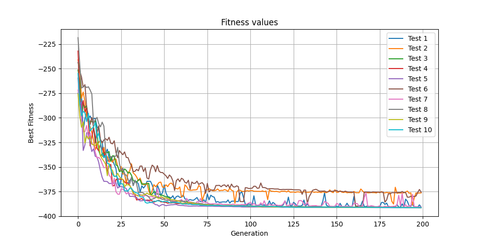
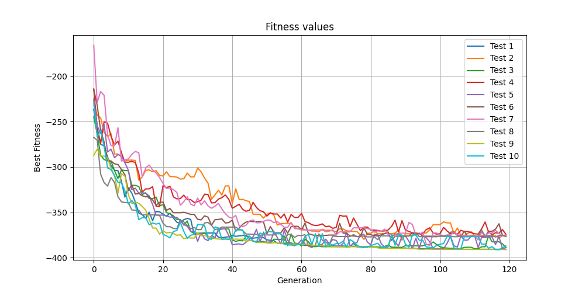
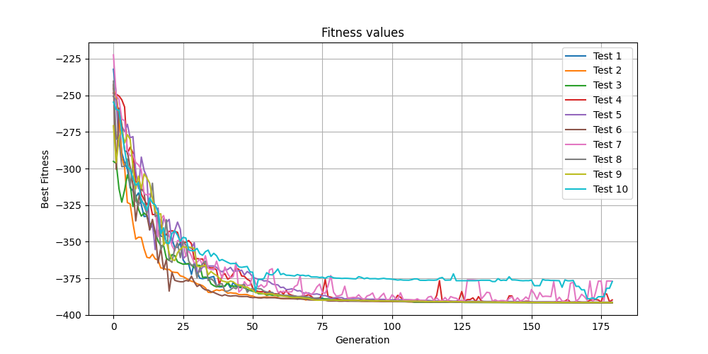

<h1 align="center" style="color: #4285F4">AEs, Swarm Intelligence</h1>

## <span style="color: #4285F4"> Cerința problemei

1. #### Să se implementeze un algoritm evolutiv pentru optimizarea unei funcţii.
2. #### Să se implementeze un algoritm PSO pentru optimizarea unei funcţii.

## <span style="color: #4285F4"> Algoritm Evolutiv - Functia Styblinski-Tang

1. #### Reprezentarea soluţiei şi funcţia de fitness:
- Soluția este reprezentată printr-o populație de indivizi, fiecare individ fiind un vector de dimensiune dată, cu valori aleatoare între -5 și 5.

```python
    def __initialize_population(self):
        population = []

        for _ in range(self.__dimensions):
            individual = []
            for _ in range(self.__population_size):
                random_value = random.uniform(-5, 5)
                individual.append(random_value)
            population.append(individual)

        return population
```

  - Funcția de fitness este definită în metoda `__evaluate_fitness()`. Aceasta calculează fitnessul pentru un individ dat, folosind formula specifică problemei, care implică evaluarea unor funcții polinomiale de gradul patru.

```python
    @staticmethod
    def __evaluate_fitness(individual):
        fitness = 0

        for gene in individual:
            fitness += (gene ** 4 - 16 * gene ** 2 + 5 * gene)
        fitness *= 0.5

        return fitness
```

2. #### Operatorii de încrucişare, mutaţie şi selecţie:
- Încrucișarea (`__crossover`): Se efectuează o încrucișare convexă între doi părinți, în care se selectează aleator un punct de crossover (k) pentru fiecare dimensiune și se calculează valorile copiilor pe baza acestui punct.

```python
    def __crossover(self, parent1, parent2):
        alpha = random.uniform(0, 1)
        k = random.randint(0, self.__dimensions - 1)
        child1 = []
        child2 = []

        for i in range(k):
            child1.append(parent1[i])
        for i in range(k, self.__dimensions):
            child1.append(alpha * parent2[i] + (1 - alpha) * parent1[i])

        for i in range(k):
            child2.append(parent2[i])
        for i in range(k, self.__dimensions):
            child2.append(alpha * parent2[i] + (1 - alpha) * parent1[i])

        return child1, child2
```

- Mutația (`__mutation`): Pentru fiecare genă a unui individ, se decide dacă se aplică mutația sau nu, pe baza unei probabilități date. Dacă se aplică mutația, gena este înlocuită cu o valoare aleatoare între -5 și 5.

```python
    def __mutation(self, individual):
        for i in range(self.__dimensions):
            random_value = random.uniform(0, 1)

            if random_value < self.__mutation_probability:
                individual[i] = random.uniform(-5, 5)

        return individual
```
  
- Selecția (`__selection`): Selecția se realizează prin alegerea unui individ din populație, cu o probabilitate proporțională cu fitnessul său. Cu cât fitnessul unui individ este mai mare, cu atât este mai mare șansa să fie selectat.

```python
    def __selection(self, population):
        fitness_value = min(self.__evaluate_fitness(individual) for individual in population)
        for individual in population:
            fitness_value += self.__evaluate_fitness(individual)

        selected_individual = None
        pick = random.uniform(0, fitness_value)
        current = 0

        for individual in population:
            current += self.__evaluate_fitness(individual)

            if current > pick:
                selected_individual = individual

        if selected_individual is None:
            selected_individual = min(population, key=lambda individual: self.__evaluate_fitness(individual))

        return selected_individual
```

3. #### Structura algoritmului evolutiv şi parametrizare:
- Dimensiunea populației, numărul de generații, dimensiunea indivizilor și probabilitatea de mutație sunt specificate la inițializarea clasei `Evo`.
- Algoritmul evolutiv constă în mai multe etape: inițializarea populației, evaluarea fitnessului, selecția, încrucișarea, mutația și actualizarea populației. Acesta se execută pentru un număr de generații specificat.
- Parametrii algoritmului evolutiv (dimensiunea populației, numărul de generații, probabilitatea de mutație) sunt aleși pentru a optimiza performanța algoritmului în rezolvarea problemei date. Acești parametri pot fi ajustați în funcție de specificul problemei și de cerințele de performanță.

```python
    def execute_search(self):
        self.__fitness_values = []
        population = self.__initialize_population()

        for generation in range(self.__number_of_generations):
            new_population = []

            for _ in range(self.__population_size):
                parent1 = self.__selection(population)
                parent2 = self.__selection(population)

                child1, child2 = self.__crossover(parent1, parent2)

                child1 = self.__mutation(child1)
                child2 = self.__mutation(child2)

                new_population.append(child1)
                new_population.append(child2)

            population = sorted(new_population, key=lambda individual: self.__evaluate_fitness(individual))
            population = population[:self.__population_size]
            self.__fitness_values.append(self.__evaluate_fitness(population[0]))

        best_individual = min(population, key=lambda individual: self.__evaluate_fitness(individual))
        return self.__evaluate_fitness(best_individual)
```

## <span style="color: #4285F4"> Algoritm PSO - Functia Styblinski-Tang

1. #### Iniţializare particule şi calcul fitness:
- Inițializare particule (`__initialize_particles`): Pentru fiecare particulă, se generează aleatoriu o poziție (`x`) și o viteză (`v`) în fiecare dimensiune. Acestea sunt utilizate pentru a inițializa o particulă, împreună cu valorile de personal best (`pbest`) și fitnessul corespunzător.

```python
    def __initialize_particles(self):
        population = []
        for _ in range(self.__particles):
            x = []
            for _ in range(self.__dimensions):
                xi = -5 + random.uniform(0, 1) * 10
                x.append(xi)

            v = []
            for _ in range(self.__dimensions):
                vi = random.uniform(0.1, 1)
                v.append(vi)

            individual = {"x": x, "v": v, "pbest": x, "pbest_fitness": self.__evaluate_fitness(x)}
            population.append(individual)

        return population
```

- Calcul fitness (`__evaluate_fitness`): Această metodă calculează fitnessul unei particule folosind formula specifică problemei. Fitnessul este determinat de valorile poziției particulei.

```python
    @staticmethod
    def __evaluate_fitness(individual):
        fitness = 0

        for gene in individual:
            fitness += (gene ** 4 - 16 * gene ** 2 + 5 * gene)
        fitness *= 0.5

        return fitness
```

2. ####  Algoritm PSO – modificare personal best, global best, viteza şi poziţie particule:
- Calcul global best (`__get_gbest`): Pentru a determina global best-ul (gbest), se parcurg toate particulele și se găsește cea cu cel mai bun fitness. Această poziție este considerată global best-ul.

```python
    def __get_gbest(self, population):
        gbest = []
        gbest_fitness = float("inf")

        for particle in population:
            fitness = self.__evaluate_fitness(particle["x"])
            if fitness < gbest_fitness:
                gbest = particle["x"]
                gbest_fitness = self.__evaluate_fitness(particle["x"])

        return gbest
```

- Modificare personal best (`execute_search`): Pentru fiecare iterație a algoritmului PSO, se parcurge fiecare particulă din populație și se actualizează personal best-ul (pbest) dacă poziția curentă are un fitness mai bun decât personal best-ul anterior.
- Modificare viteză și poziție particule (`execute_search`): Pentru fiecare particulă, se actualizează viteza pe baza formulei PSO, care implică componente aleatorii și influența personal best-ului și global best-ului. Apoi, poziția este actualizată pe baza noii viteze calculate.

```python
    def execute_search(self):
        best_individual = None

        for i in range(self.__iterations):
            population = self.__initialize_particles()
            w = i / self.__iterations

            for particle in population:
                if self.__evaluate_fitness(particle["x"]) < self.__evaluate_fitness(particle["pbest"]):
                    particle["pbest"] = particle["x"]
                    particle["pbest_fitness"] = self.__evaluate_fitness(particle["x"])

            gbest = self.__get_gbest(population)

            for particle in population:
                for j in range(len(particle["v"])):
                    particle["v"][j] = (w * particle["v"][j] +
                                        self.__c1 * random.uniform(0, 1) * (particle["pbest"][j] - particle["x"][j]) +
                                        self.__c2 * random.uniform(0, 1) * (gbest[j] - particle["x"][j]))

                for j in range(len(particle["x"])):
                    particle["x"][j] += particle["v"][j]

            if best_individual is None or self.__evaluate_fitness(gbest) < self.__evaluate_fitness(best_individual):
                best_individual = gbest

        return self.__evaluate_fitness(best_individual)
```

3. #### Parametrizarea algoritmului:
- Parametrii algoritmului PSO includ dimensiunea grupului de particule (particles) și numărul de iterații (iterations). Acești parametri sunt specificați la inițializarea clasei PSO și sunt utilizați pentru a controla comportamentul și performanța algoritmului.
- Dimensiunea grupului de particule determină câte particule sunt generate și urmărite în fiecare iterație.
- Numărul de iterații reprezintă câte iterații sunt executate de algoritm pentru a căuta soluția optimă. Mai multe iterații pot duce la o explorare mai bună a spațiului de căutare, dar pot necesita mai mult timp de calcul.

## <span style="color: #4285F4"> Date obtinute - Algoritm Evolutiv - Functia Styblinski-Tang

### 1. Tabel de date

| Dimeniune populație | Număr generații | Probabilitate mutatie | Numar dimensiuni | Valoare medie | Valoarea cea mai bună | Număr execuții | Timpul mediu de execuție |
|---------------------|-----------------|-----------------------|------------------|---------------|-----------------------|----------------|--------------------------|
| 50                  | 100             | 0.01                  | 2                | -72.5822      | -78.3323              | 10             | 0.7925                   |
| 100                 | 150             | 0.02                  |                  | -76.3244      | -78.3323              |                | 5.1551                   |
| 200                 | 200             | 0.05                  |                  | -77.8262      | -78.3323              |                | 22.0688                  |
| 75                  | 120             | 0.03                  |                  | -77.7204      | -78.3323              |                | 1.9209                   |
| 150                 | 180             | 0.04                  |                  | -76.4884      | -78.3323              |                | 11.6085                  |
| 50                  | 100             | 0.01                  | 10               | -377.1237     | -390.4894             |                | 2.9234                   |
| 100                 | 150             | 0.02                  |                  | -388.3045     | -391.5999             |                | 17.9142                  |
| 200                 | 200             | 0.05                  |                  | -388.1484     | -391.5120             |                | 92.8099                  |
| 75                  | 120             | 0.03                  |                  | -382.3842     | -390.9598             |                | 7.8845                   |
| 150                 | 180             | 0.04                  |                  | -388.4110     | -391.5672             |                | 47.0693                  |

### 2. Analiza evolutiei celui mai bun individ din populatie per generatie












## <span style="color: #4285F4"> Date obtinute - Algoritm PSO - Functia Styblinski-Tang

| Numar particule | c1  | c2  | Numar iteratii | Numar dimensiuni | Valoare medie | Valoarea cea mai bună | Număr execuții | Timpul mediu de execuție |
|-----------------|-----|-----|----------------|------------------|---------------|-----------------------|----------------|--------------------------|
| 20              | 1.5 | 1.5 | 100            | 2                | -78.0582      | -78.3237              | 10             | 0.0093                   |
| 30              | 2   | 2   | 150            |                  | -78.1092      | -78.3322              |                | 0.0178                   |
| 50              | 2.5 | 1   | 200            |                  | -71.9178      | -77.9998              |                | 0.0003                   |
| 25              | 2.5 | 1   | 120            |                  | -78.0362      | -78.2843              |                | 0.0114                   |
| 40              | 1.8 | 1.8 | 100            |                  | -78.2222      | -78.3231              |                | 0.0284                   |
| 50              | 2   | 2   | 200            | 10               | -302.0934     | -321.1110             |                | 0.1439                   |
| 30              | 1.5 | 1.5 | 150            |                  | -289.6691     | -310.4580             |                | 0.0653                   |
| 40              | 1   | 2   | 100            |                  | -294.6896     | -323.7382             |                | 0.1076                   |
| 25              | 2.5 | 1   | 120            |                  | -282.6461     | -294.3825             |                | 0.0446                   |
| 35              | 1.8 | 1.8 | 170            |                  | -295.9872     | -322.0875             |                | 0.0897                   |

## <span style="color: #4285F4"> Observații

### Algoritm Evolutiv - Functia Styblinski-Tang

1. #### Dimensiunea populației și numărul de generații:
   - Se observă o variație a dimensiunii populației și a numărului de generații între diferitele seturi de date. Acest lucru arată că experimentele au fost realizate pentru a evalua cum influențează acești parametri performanța algoritmului.
2. #### Probabilitatea de mutație:
   - Probabilitatea de mutație variază între 0.01 și 0.05 în diferitele seturi de date. O probabilitate mai mare de mutație poate duce la o explorare mai amplă a spațiului de căutare, dar poate crește și timpul de convergență.
3. #### Numărul de dimensiuni:
   - Se observă că au fost realizate teste atât pentru 2 dimensiuni, cât și pentru 10 dimensiuni. Numărul de dimensiuni influențează complexitatea problemei și poate afecta performanța algoritmului.
4. #### Valoarea medie a fitnessului:
   - Valoarea medie a fitnessului variază între -72.5822 și -388.4110, în funcție de diferitele configurații de parametri și dimensiuni. Această valoare reprezintă o estimare a performanței medii a algoritmului pentru fiecare set de date.Valoarea cea mai bună a fitnessului:
5. #### Valoarea cea mai bună a fitnessului:
   - Se observă că au fost realizate un număr specific de execuții pentru fiecare set de date, iar timpul mediu de execuție este raportat. Aceste informații sunt importante pentru a evalua timpul de calcul și stabilitatea algoritmului în diferite condiții.

### Algoritm PSO - Functia Styblinski-Tang

1. #### Numărul de particule și numărul de iterații:
    - Seturile de date variază în ceea ce privește numărul de particule și numărul de iterații. Numărul mare de particule și iterații poate contribui la o explorare mai cuprinzătoare a spațiului de căutare, dar poate afecta și timpul de execuție.
2. #### Parametrii c1 și c2:
    - Valorile parametrilor c1 și c2 influențează modul în care viteza particulelor este actualizată în cadrul algoritmului PSO. Valorile mai mari pot contribui la o explorare mai amplă a spațiului de căutare, dar pot duce și la oscilații mari sau convergență lentă.
3. #### Numărul de dimensiuni:
    - Algoritmul PSO a fost testat atât pentru 2 dimensiuni, cât și pentru 10 dimensiuni. Performanța algoritmului poate varia semnificativ în funcție de numărul de dimensiuni, deoarece crește complexitatea spațiului de căutare.
4. #### Valoarea medie și valoarea cea mai bună a fitnessului:
    - Se observă că valorile medii și cele mai bune ale fitnessului variază semnificativ între diferitele seturi de date. Acest lucru sugerează că performanța algoritmului poate fi influențată de configurația specifică a parametrilor și a dimensiunilor.
5. #### Numărul de execuții și timpul mediu de execuție:
    - Pentru fiecare set de date, se specifică numărul de execuții și timpul mediu de execuție. Acest lucru poate oferi informații despre stabilitatea și eficiența algoritmului în diferite condiții de intrare.

## <span style="color: #4285F4"> Concluzii

<p>Acest material furnizează o analiză comparativă între două tehnici de optimizare - algoritmul evolutiv și algoritmul PSO - utilizate pentru optimizarea unei funcții specificate, în acest caz funcția Styblinski-Tang. Am examinat reprezentarea soluțiilor, funcțiile de fitness, operatorii genetici și parametrii algoritmilor pentru ambele abordări. Prin intermediul datelor obținute și a analizei lor, am evaluat performanța celor două algoritmi în diferite condiții de intrare. </p>
<p>Concluzia principală este că atât algoritmul evolutiv, cât și algoritmul PSO pot fi eficiente în optimizarea funcției Styblinski-Tang, însă performanța lor poate varia în funcție de parametrii specifici și de configurarea problemei. De exemplu, algoritmul PSO pare să aibă o performanță mai bună în anumite configurații de parametri și dimensiuni, în timp ce algoritmul evolutiv se poate descurca mai bine la altele.</p>
<p>Prin urmare, alegerea între aceste două tehnici depinde de natura specifică a problemei, de cerințele de performanță și de experiența practică în aplicarea lor. Este important să se efectueze experimente și să se ajusteze parametrii pentru a obține cea mai bună performanță într-un context dat.</p>

## <span style="color: #4285F4"> Datele obținute după rulări
- ### Algoritm Evolutiv - Functia Styblinski-Tang

```python
Algoritm folosit: algoritm evolutiv
Dimensiune populatie = 50
Numar generatii = 100
Probabilitate de mutatie: 0.01
Numar de dimensiuni: 2
Numar rulari: 10. Rezultatele obtinute sunt:

-77.78782666717314          0.7963974475860596
-77.98568865448286          0.7746241092681885
-64.16480820034315          0.781531572341919
-78.33233140754282          0.8186521530151367
-64.1436727098374          0.7698490619659424
-78.19487546491133          0.804570198059082
-64.41163250307861          0.7709794044494629
-78.29005046413076          0.8123433589935303
-64.18375796902235          0.7812259197235107
-78.32801616159675          0.815544605255127

Valoare medie obtinuta: -72.58226602021192
Valoare maxima obtinuta: -78.33233140754282
Timp de executie mediu: 0.7925717830657959

Algoritm folosit: algoritm evolutiv
Dimensiune populatie = 100
Numar generatii = 150
Probabilitate de mutatie: 0.02
Numar de dimensiuni: 2
Numar rulari: 10. Rezultatele obtinute sunt:

-77.60357961200195          4.734063386917114
-78.33181445927592          4.975531339645386
-78.33230605644019          5.095538139343262
-64.19397766340916          4.761814832687378
-78.33233140754285          5.060552597045898
-78.3238625586114          4.968390941619873
-78.33232904777249          5.001569509506226
-78.33195045849934          4.963762998580933
-78.33219510142281          5.987257480621338
-73.13007790322612          6.003046751022339

Valoare medie obtinuta: -76.32444242682023
Valoare maxima obtinuta: -78.33233140754285
Timp de executie mediu: 5.155152797698975

Algoritm folosit: algoritm evolutiv
Dimensiune populatie = 200
Numar generatii = 200
Probabilitate de mutatie: 0.05
Numar de dimensiuni: 2
Numar rulari: 10. Rezultatele obtinute sunt:

-78.12188469147772          21.63319969177246
-75.54352859013056          21.54831838607788
-78.12987244662216          21.51556086540222
-78.33233132775959          22.72666573524475
-78.3322697849152          22.534643411636353
-78.33233140754285          22.443024158477783
-77.36254246935611          21.291780710220337
-78.3322292814395          22.659393787384033
-77.44352333732346          21.4756920337677
-78.33233140754285          22.860344886779785

Valoare medie obtinuta: -77.826284474411
Valoare maxima obtinuta: -78.33233140754285
Timp de executie mediu: 22.06886236667633

Algoritm folosit: algoritm evolutiv
Dimensiune populatie = 75
Numar generatii = 120
Probabilitate de mutatie: 0.03
Numar de dimensiuni: 2
Numar rulari: 10. Rezultatele obtinute sunt:

-78.32460899824628          1.988682746887207
-78.32099737597784          1.9362938404083252
-78.2459017670497          1.9762144088745117
-78.32784778666732          1.922196626663208
-78.33233140754285          1.93076753616333
-78.31807846109756          1.9398300647735596
-72.462616171262          1.820270299911499
-78.33233138065864          1.9573147296905518
-78.31485662045952          1.9032683372497559
-78.22456539523257          1.8345963954925537

Valoare medie obtinuta: -77.72041353641943
Valoare maxima obtinuta: -78.33233140754285
Timp de executie mediu: 1.9209434986114502

Algoritm folosit: algoritm evolutiv
Dimensiune populatie = 150
Numar generatii = 180
Probabilitate de mutatie: 0.04
Numar de dimensiuni: 2
Numar rulari: 10. Rezultatele obtinute sunt:

-78.3323277628725          11.544451713562012
-78.33231455650048          11.349778175354004
-78.0075721568585          11.359663486480713
-78.3321127146002          12.124316692352295
-78.33215866596474          12.64243769645691
-78.33231903606097          11.968369007110596
-78.33213051941144          11.564880132675171
-60.21966604233747          10.800071239471436
-78.33160871200354          11.119771242141724
-78.33233140754285          11.611682415008545

Valoare medie obtinuta: -76.48845415741526
Valoare maxima obtinuta: -78.33233140754285
Timp de executie mediu: 11.60854218006134

Algoritm folosit: algoritm evolutiv
Dimensiune populatie = 50
Numar generatii = 100
Probabilitate de mutatie: 0.01
Numar de dimensiuni: 10
Numar rulari: 10. Rezultatele obtinute sunt:

-386.0616741291929          2.907217264175415
-354.6709143580793          2.8553621768951416
-360.34863057286435          3.004342794418335
-390.4894935519597          2.8984806537628174
-372.45469302886613          2.9307682514190674
-389.7691864263389          3.0929229259490967
-376.2792980396547          2.938466787338257
-388.7799809656632          2.8995301723480225
-375.81981246571473          2.8635153770446777
-376.5633472770138          2.843541145324707

Valoare medie obtinuta: -377.12370308153476
Valoare maxima obtinuta: -390.4894935519597
Timp de executie mediu: 2.9234147548675535

Algoritm folosit: algoritm evolutiv
Dimensiune populatie = 100
Numar generatii = 150
Probabilitate de mutatie: 0.02
Numar de dimensiuni: 10
Numar rulari: 10. Rezultatele obtinute sunt:

-390.7796882813643          16.750499963760376
-391.599950949523          18.369447708129883
-391.21171588194056          18.372113466262817
-391.45801632319717          17.489962339401245
-391.4598104993937          18.183610439300537
-387.48841041546905          19.01192545890808
-390.5140757273213          16.929550409317017
-390.1744675133649          17.210010051727295
-384.32078287708777          19.04049324989319
-374.0388141301421          17.784997701644897

Valoare medie obtinuta: -388.3045732598804
Valoare maxima obtinuta: -391.599950949523
Timp de executie mediu: 17.914261078834535

Algoritm folosit: algoritm evolutiv
Dimensiune populatie = 200
Numar generatii = 200
Probabilitate de mutatie: 0.05
Numar de dimensiuni: 10
Numar rulari: 10. Rezultatele obtinute sunt:

-390.85822363028944          93.01163744926453
-376.374758625923          89.45788359642029
-391.26328056113243          96.92539691925049
-391.2864012875731          94.91652536392212
-391.5120440439268          95.1680703163147
-375.5996985007375          89.37643933296204
-390.6521730098218          91.9521369934082
-391.21353765238575          92.98858261108398
-391.36919591565675          91.8434808254242
-391.3550076261208          92.45889043807983

Valoare medie obtinuta: -388.1484320853567
Valoare maxima obtinuta: -391.5120440439268
Timp de executie mediu: 92.80990438461303

Algoritm folosit: algoritm evolutiv
Dimensiune populatie = 75
Numar generatii = 120
Probabilitate de mutatie: 0.03
Numar de dimensiuni: 10
Numar rulari: 10. Rezultatele obtinute sunt:

-390.70975463033955          7.684475898742676
-375.58153944338545          8.3717520236969
-388.8007250795661          8.612864017486572
-374.11039575176795          8.599499464035034
-388.82964909254144          8.061820030212402
-376.61054494400406          7.466928243637085
-374.97536922033316          7.581920623779297
-376.3482050949335          7.4817795753479
-390.9598425387332          7.499782562255859
-386.916175411845          7.484422206878662

Valoare medie obtinuta: -382.38422012074494
Valoare maxima obtinuta: -390.9598425387332
Timp de executie mediu: 7.884524464607239

Algoritm folosit: algoritm evolutiv
Dimensiune populatie = 150
Numar generatii = 180
Probabilitate de mutatie: 0.04
Numar de dimensiuni: 10
Numar rulari: 10. Rezultatele obtinute sunt:

-391.5010480611437          46.95819854736328
-391.5672952679025          46.84204912185669
-391.5470779519749          45.601239919662476
-389.70222049070696          47.84177827835083
-391.20945642324216          47.78790593147278
-391.5393263757189          47.22173523902893
-376.91609890919364          48.07430362701416
-391.4977325146238          45.60553765296936
-391.45503345894633          47.76717281341553
-377.1754163791044          46.9935564994812

Valoare medie obtinuta: -388.41107058325576
Valoare maxima obtinuta: -391.5672952679025
Timp de executie mediu: 47.06934776306152
```

- ### Algoritm PSO - Functia Styblinski-Tang

```python
Algoritm folosit: PSO
Numar particule = 20
c1 = 1.5
c2 = 1.5
Numar iteratii = 100
Numar de dimensiuni: 2
Numar rulari: 10. Rezultatele obtinute sunt:

Algoritm folosit: PSO
Numar particule = 20
c1 = 1.5
c2 = 1.5
Numar iteratii = 100
Numar de dimensiuni: 2
Numar rulari: 10. Rezultatele obtinute sunt:

-78.32373298036902          0.008507251739501953
-77.73258327901958          0.010011911392211914
-77.99196082960435          0.009780168533325195
-77.7823278110168          0.009506702423095703
-78.27942034402136          0.010511398315429688
-78.12128192408491          0.010507822036743164
-78.21998124558          0.00750732421875
-78.06173787086655          0.009633779525756836
-78.27707728467561          0.009636402130126953
-77.7925651418428          0.00783991813659668

Valoare medie obtinuta: -78.05826687110809
Valoare maxima obtinuta: -78.32373298036902
Timp de executie mediu: 0.009344267845153808

Algoritm folosit: PSO
Numar particule = 30
c1 = 2.0
c2 = 2.0
Numar iteratii = 150
Numar de dimensiuni: 2
Numar rulari: 10. Rezultatele obtinute sunt:

-78.09632656277643          0.01801276206970215
-78.28727974338625          0.016506671905517578
-78.33229401679978          0.016013383865356445
-78.0906883278016          0.016008853912353516
-78.10896042580924          0.016663074493408203
-78.13172542481422          0.01975417137145996
-77.98985465024722          0.020240306854248047
-77.95658768256943          0.016368389129638672
-77.78602872301849          0.01985311508178711
-78.31277377481673          0.018990516662597656

Valoare medie obtinuta: -78.10925193320394
Valoare maxima obtinuta: -78.33229401679978
Timp de executie mediu: 0.017841124534606935

Algoritm folosit: PSO
Numar particule = 50
c1 = 2.5
c2 = 200.0
Numar iteratii = 1
Numar de dimensiuni: 2
Numar rulari: 10. Rezultatele obtinute sunt:

-64.57133871775407          0.0
-71.33163143592871          0.001001119613647461
-77.99989770203146          0.0
-61.13152576915462          0.0009982585906982422
-73.70639472390582          0.0
-63.42269041731211          0.0009999275207519531
-77.98565092421538          0.0
-77.08513265263264          0.00099945068359375
-74.92149444218765          0.0
-77.02312141193596          0.0

Valoare medie obtinuta: -71.91788781970584
Valoare maxima obtinuta: -77.99989770203146
Timp de executie mediu: 0.00039987564086914064

Algoritm folosit: PSO
Numar particule = 25
c1 = 2.5
c2 = 1.0
Numar iteratii = 120
Numar de dimensiuni: 2
Numar rulari: 10. Rezultatele obtinute sunt:

-78.25688407282237          0.013500213623046875
-77.91941156216257          0.011507511138916016
-78.2466806111868          0.010506629943847656
-77.57329889157657          0.010015010833740234
-78.23534905649777          0.011123895645141602
-78.28433133152552          0.012396097183227539
-78.23730571782644          0.010507345199584961
-77.55173697347432          0.011507034301757812
-78.00433880918851          0.011596202850341797
-78.05324246362477          0.011527538299560547

Valoare medie obtinuta: -78.03625794898856
Valoare maxima obtinuta: -78.28433133152552
Timp de executie mediu: 0.011418747901916503

Algoritm folosit: PSO
Numar particule = 40
c1 = 1.8
c2 = 1.8
Numar iteratii = 180
Numar de dimensiuni: 2
Numar rulari: 10. Rezultatele obtinute sunt:

-78.0665161042198          0.03313183784484863
-77.98654594817191          0.030697107315063477
-78.21641383914974          0.030153512954711914
-78.29678474631619          0.0305328369140625
-78.3137053354506          0.025516748428344727
-78.1127434696584          0.02666473388671875
-78.31530786440868          0.027414560317993164
-78.31326377236016          0.02756953239440918
-78.27790882184642          0.026298046112060547
-78.32313387907061          0.026142597198486328

Valoare medie obtinuta: -78.22223237806524
Valoare maxima obtinuta: -78.32313387907061
Timp de executie mediu: 0.02841215133666992

Algoritm folosit: PSO
Numar particule = 50
c1 = 2.0
c2 = 2.0
Numar iteratii = 200
Numar de dimensiuni: 10
Numar rulari: 10. Rezultatele obtinute sunt:

-282.95834059689736          0.14856767654418945
-304.13305007054686          0.14614105224609375
-296.9438896435425          0.14193439483642578
-305.76435505951787          0.1433391571044922
-282.3538443033723          0.14498639106750488
-318.916201561918          0.145538330078125
-295.7244091383938          0.14226818084716797
-310.89457466578625          0.14279437065124512
-321.11109057992894          0.1423170566558838
-302.1345609177487          0.14177894592285156

Valoare medie obtinuta: -302.09343165376526
Valoare maxima obtinuta: -321.11109057992894
Timp de executie mediu: 0.14396655559539795

Algoritm folosit: PSO
Numar particule = 30
c1 = 1.5
c2 = 1.5
Numar iteratii = 150
Numar de dimensiuni: 10
Numar rulari: 10. Rezultatele obtinute sunt:

-290.08778811112825          0.06566119194030762
-267.69301909586443          0.06421375274658203
-286.0708262989417          0.06476497650146484
-291.53362417485096          0.06631946563720703
-304.23879909382697          0.06444525718688965
-280.9319788339126          0.06486296653747559
-273.9882537770534          0.06720471382141113
-300.1134055408395          0.06369590759277344
-310.45809144062065          0.0677647590637207
-291.5758743901741          0.06438398361206055

Valoare medie obtinuta: -289.66916607572125
Valoare maxima obtinuta: -310.45809144062065
Timp de executie mediu: 0.06533169746398926

Algoritm folosit: PSO
Numar particule = 40
c1 = 1.0
c2 = 2.0
Numar iteratii = 180
Numar de dimensiuni: 10
Numar rulari: 10. Rezultatele obtinute sunt:

-292.9903454277346          0.10515785217285156
-296.6546034440058          0.10372495651245117
-282.06884591199486          0.10447382926940918
-279.3778954668941          0.11464047431945801
-293.5881087395394          0.10202360153198242
-323.4222278679969          0.10628676414489746
-287.45571711423094          0.10941004753112793
-283.00898312645467          0.11132192611694336
-284.59138977812006          0.11200141906738281
-323.73821585905966          0.10771560668945312

Valoare medie obtinuta: -294.68963327360314
Valoare maxima obtinuta: -323.73821585905966
Timp de executie mediu: 0.10767564773559571

Algoritm folosit: PSO
Numar particule = 25
c1 = 2.5
c2 = 1.0
Numar iteratii = 120
Numar de dimensiuni: 10
Numar rulari: 10. Rezultatele obtinute sunt:

-278.876089713362          0.05196404457092285
-279.080791101018          0.042528629302978516
-271.58966322168226          0.04581022262573242
-276.2231669690607          0.04376387596130371
-287.43193221890346          0.04357624053955078
-275.5699287644277          0.04408764839172363
-289.28279714304796          0.041864633560180664
-292.81568309829294          0.04372096061706543
-294.3825344082198          0.04316973686218262
-281.20852555207364          0.045801401138305664

Valoare medie obtinuta: -282.64611121900884
Valoare maxima obtinuta: -294.3825344082198
Timp de executie mediu: 0.04462873935699463

Algoritm folosit: PSO
Numar particule = 35
c1 = 1.8
c2 = 1.8
Numar iteratii = 170
Numar de dimensiuni: 10
Numar rulari: 10. Rezultatele obtinute sunt:

-296.8439397487494          0.09403109550476074
-322.087537486993          0.08571696281433105
-289.98910996722225          0.0878148078918457
-308.36603273140844          0.09267473220825195
-289.267806250022          0.0893392562866211
-284.66344173921425          0.09102320671081543
-298.2293715749214          0.09693217277526855
-302.2408165986083          0.08578681945800781
-289.7611174293099          0.08707952499389648
-278.4232099878831          0.08739709854125977

Valoare medie obtinuta: -295.9872383514332
Valoare maxima obtinuta: -322.087537486993
Timp de executie mediu: 0.08977956771850586
```